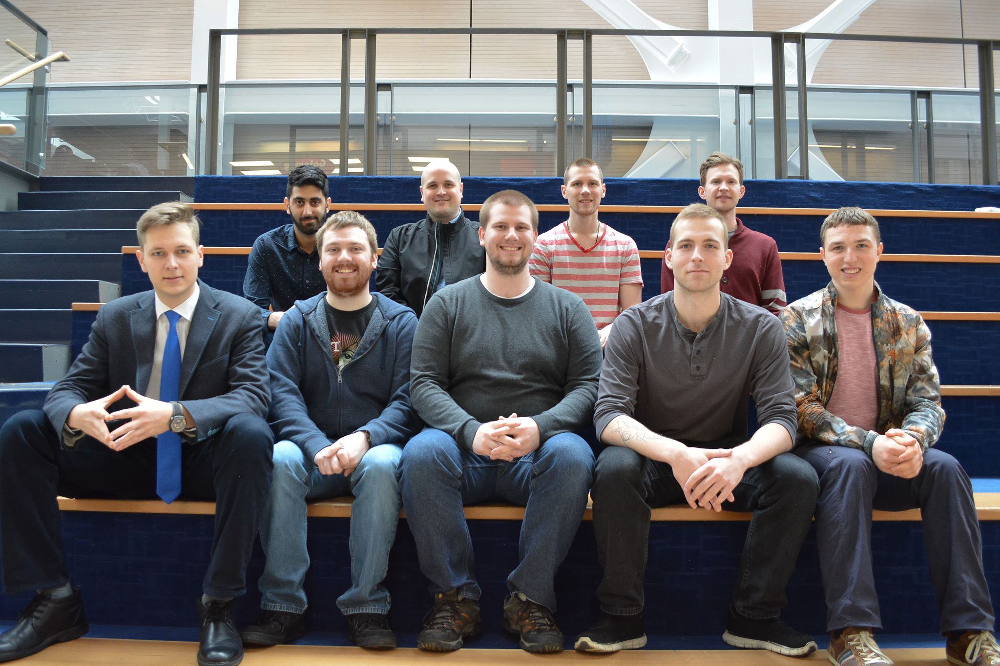
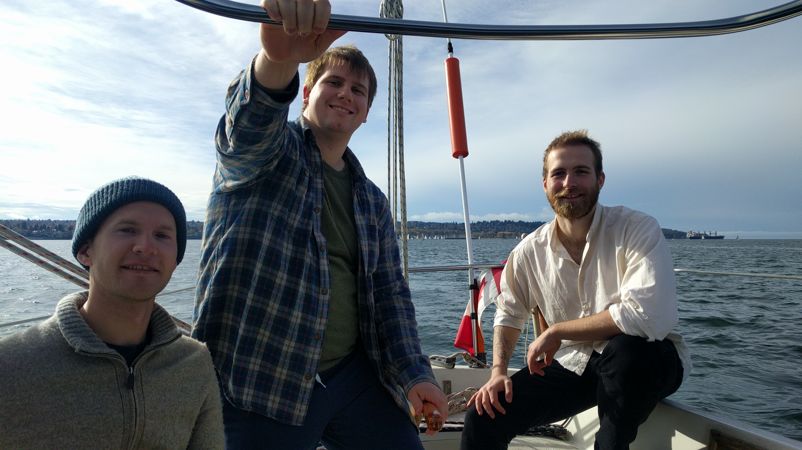

# The Team

BCIT Sailbot is a student initiative under the IEEE BCIT Student Branch to 
design and build an autonomous sailboat, or "sailbot" for the International 
Robotic Sailing Regatta (IRSR) in June 2018. This will be BCIT's first time 
competing!

Our team consists of a students that come from BCIT's Mechatronics, Electrical
Engineering and Mechanical Engineering programs. These are students who, ontop
of their formal education in engineering, wish to dedicate even more time to be
part of a challenging project. 

## Sail Whaaaat?

A sailbot is an autonomous sailboat. By relying on the wind for propulsion, and 
using solar power to reliably power the entire craft we have a vehicle that is
well suited for long distance voyages.

Sailbots have great potential in applications such as fish stock management, 
environmental monitoring for the mining and petroleum industries and 
oceanography. It is a developing technology and competitions like the IRSR give
students the opportunity to contribute to its advancement.

One of our keys to success will be our use of a self-trimming wing sail over
a traditional sail. This design reduces the number of control points, eliminates
the need for rigging, and significantly increases mechanical robustness needed
for autonomous sailing. BCIT is also set appart from other institutions because
we will have the ability to do most, if not all of the manufacturing in our own
facilities.

## The Competition

Every year teams from across the world come to compete at the [International
Robotic Sailing Regatta](http://sailbot.org). At the IRSR, there are a number of
races that test navigation, tactics and design. During the competiton, the
saiboat must steer and trim sails based on measurements of the wind, position,
and direction without human intervention. 
